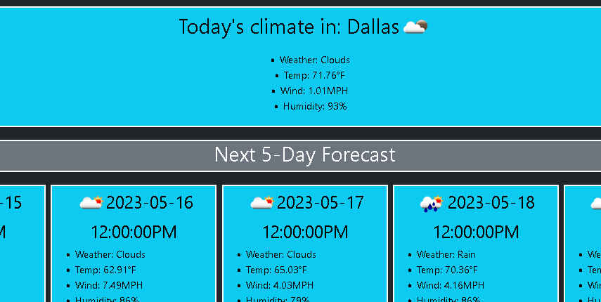

# weather-dashboard

## Table of Contents

- [Description](#Description)
- [Installation](#Deployment)
- [Usage](#Usage)
- [License](#License)
- [Questions?](#Questions?)

## Description

A rudimentary weather dashboard app using OpenWeatherMap API. Made using the criteria from Module 6 of my edX Web Development bootcamp.

## Deployment

## Usage

Input a city into the text field on the left and hit the search button.
Deployed on the right is the weather data for that city, as well as a 5-day prediction of it's future weather at 12pm for each of the displayed 5 days.

## Demonstration

## License

This project is protected under the MIT License.

## Questions?

Reach out to me either on [GitHub](https://github.com/NoahJRalph) or by [Email](mailto:NoahJRalph@gmail.com)!
